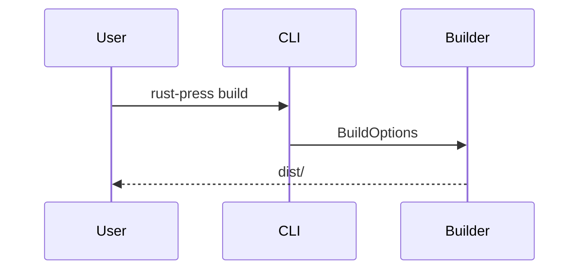

# Markdown

Markdown is parsed by `pulldown-cmark`. The MVP enables tables, task lists, strikethrough, footnotes, heading attributes, heading anchors, and Mermaid fenced blocks.

## Heading Anchors

Every heading receives a stable anchor. Non-ASCII headings are preserved, so a heading like `中文 标题` becomes `#中文-标题`.

## Mermaid

Fenced code blocks with the `mermaid` language are emitted as Mermaid blocks and rendered by a client-side Mermaid script.

## Search Text

Code blocks are excluded from the search index when `index_code = false`.
