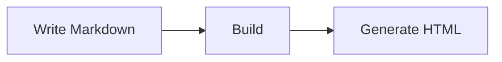

# Markdown Tutorial

This tutorial summarizes common Markdown syntax and the extensions currently enabled by RustPress. The examples can be copied directly into `.md` files under `docs/`.

## Frontmatter

Each page can start with YAML frontmatter to define page metadata such as title, search behavior, and access mode.

```yaml
---
title: Page Title
layout: doc
sidebar: true
search: true
access: public
---
```

## Headings

Use `#` for headings. More `#` characters mean a deeper heading level.

```markdown
# Heading 1
## Heading 2
### Heading 3
#### Heading 4
```

RustPress generates stable anchors for headings, so sections can be linked directly.

## Paragraphs And Line Breaks

Separate text with a blank line to create a new paragraph.

```markdown
This is the first paragraph.

This is the second paragraph.
```

To force a line break inside the same paragraph, add two spaces at the end of the line or use `<br>`.

```markdown
First line  
Second line
```

## Emphasis

Use `*` or `_` for italic and bold text. Use `~~` for strikethrough.

```markdown
*Italic*
_Italic_

**Bold**
__Bold__

***Bold italic***

~~Strikethrough~~
```

## Lists

Use `-`, `*`, or `+` for unordered lists. Use numbers followed by periods for ordered lists.

```markdown
- First item
- Second item
  - Nested item
  - Nested item

1. First step
2. Second step
3. Third step
```

## Task Lists

Task lists use `- [ ]` and `- [x]`.

```markdown
- [x] Finish configuration
- [ ] Write documentation
- [ ] Publish the site
```

## Links And Images

Links use `[text](url)`. Images use ``.

```markdown
[Visit the homepage](/)
[CLI guide](/en/guide/cli/)


```

Links and images can also include titles.

```markdown
[RustPress](/en/ "Back to homepage")

```

## Blockquotes

Use `>` for blockquotes. They can span multiple lines and can be nested.

```markdown
> This is a quote.
>
> A quote can contain multiple paragraphs.

> Level one
>> Level two
```

## Inline Code

Wrap inline code with backticks.

```markdown
Run `rust-press build` to generate the static site.
```

## Code Blocks

Use three backticks for code blocks. Add a language name to enable syntax highlighting.

````markdown
```bash
rust-press build --config rustpress.toml
```

```rust
fn main() {
    println!("hello");
}
```
````

## Tables

Use pipes to separate columns. The second row defines the header separator.

```markdown
| Syntax | Purpose |
| --- | --- |
| `#` | Heading |
| `-` | Unordered list |
| `` `code` `` | Inline code |
```

Use colons to control alignment.

```markdown
| Left | Center | Right |
| :--- | :---: | ---: |
| A | B | C |
```

## Footnotes

Footnotes use `[^name]` markers and matching definitions elsewhere in the document.

```markdown
RustPress supports footnotes.[^note]

[^note]: This is the footnote content.
```

## Heading Attributes

Headings can define custom attributes. The most common use is a custom `id`.

```markdown
## Install {#install}
```

This allows links such as `/en/guide/markdown-tutorial/#install`.

## Mermaid Diagrams

Code blocks with the `mermaid` language are rendered as diagrams.

````markdown

````

## Horizontal Rules

Use three or more `-`, `*`, or `_` characters to create a horizontal rule.

```markdown
---
***
___
```

## Escaping Characters

Prefix Markdown control characters with a backslash to display them literally.

```markdown
\# This is not a heading
\* This is not a list
\[This is not a link\](https://example.com)
```

## HTML

Small amounts of HTML can be written directly in Markdown. Prefer it only when Markdown cannot express the content.

```html
<kbd>Shift</kbd>
<br>
<span class="custom">Custom content</span>
```
