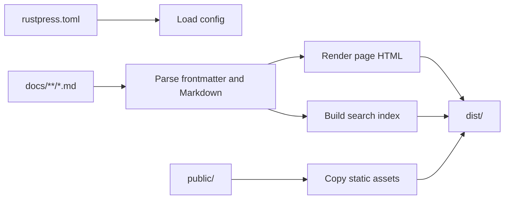

# RustPress

RustPress is a Rust-first static documentation generator. It reads `rustpress.toml`, renders Markdown from `docs/` into static HTML, writes theme assets, builds a local search index, and emits copyable Markdown source files.

## When To Use It

- Project docs, CLI manuals, SDK guides, and internal knowledge bases.
- Sites where one TOML file should control top navigation, sidebars, locales, theme behavior, search, and access masks.
- Static output that can be deployed to GitHub Pages, object storage, or any static server.
- Docs that need search, dark mode, code copy, Mermaid diagrams, Markdown source copy, and a lightweight viewing mask.

## Feature Map

| Feature | What RustPress Does | Start Here |
| --- | --- | --- |
| CLI workflow | Initialize, build, develop with reload, and preview generated output | [CLI](/en/guide/cli/) |
| Configuration | `top_nav`, `sidebars`, `locales`, theme, search, access mask | [Configuration](/en/guide/configuration/) |
| Markdown rendering | Tables, task lists, footnotes, heading attributes, code highlight, line numbers, copy buttons | [Markdown](/en/features/markdown/) |
| Mermaid | Render `mermaid` fenced code blocks in the browser | [Markdown Tutorial](/en/guide/markdown-tutorial/) |
| Theme | Top nav, sidebar, table of contents, mobile layout, Light/Dark switch, GitHub link | [Theme](/en/features/theme/) |
| Search | Local JSON index with English normalization and CJK token support | [Search](/en/features/search/) |
| Locales | `docs/<locale>/` routes, language switcher, translation fallback | [Configuration](/en/guide/configuration/#multilingual-docs) |
| Access mask | Front-end password mask for pages marked `access: masked` | [Access Mask](/en/features/access-mask/) |
| Workspace architecture | Separated crates for CLI, core build, Markdown, theme, search, and dev server | [Crates](/en/internals/crates/) |

## Build Pipeline



## Static Output

A build writes:

- `index.html` for each page.
- `index.md.txt` for each page, used by the Markdown copy menu.
- `assets/rustpress.css` and `assets/rustpress.js`.
- Search assets when enabled: `assets/search-index.json`, `assets/search-index.json.br`, and `assets/rustpress_search_bg.wasm`.
- Custom files copied from `public/`.

## Quick Start

```bash
cargo install rust-press
rust-press init my-docs
cd my-docs
rust-press dev
```

The development server defaults to `http://127.0.0.1:5177/`. For static output:

```bash
rust-press build --config rustpress.toml
```

## Security Boundary

RustPress emits static files. The access mask is a front-end viewing layer; it does not encrypt HTML or prevent direct access to generated files. Put the site behind real authentication if the content is sensitive.
