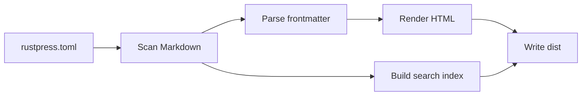

# RustPress

RustPress is a Rust-first static documentation generator MVP. It reads `rustpress.toml`, scans Markdown from `docs/`, renders static HTML, writes theme assets, and builds a local search index.

## Current MVP

- `rust-press init [dir]` creates a minimal docs project.
- `rust-press build` renders Markdown into `dist/`.
- `rust-press dev` rebuilds when Markdown or config files change.
- `rust-press preview` serves the generated static output.
- The default theme includes Light/Dark switching, local search, Mermaid rendering, sidebar navigation, and a front-end access mask.

## Build Flow

## Try Search

Search for English words like `theme`, `build`, or `Mermaid`. Search also includes Chinese content, for example `搜索` and `访问遮罩`.

## Static Output

The generated site is fully static. Access masking is a user-interface layer only; page HTML remains present in `dist/`.
