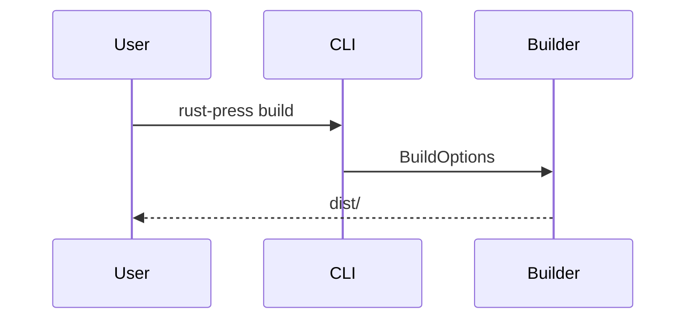

# Markdown

Markdown 由 `pulldown-cmark` 解析。当前 MVP 启用了表格、任务列表、删除线、脚注、标题属性、标题锚点和 Mermaid fenced blocks。

## 标题锚点

每个标题都会获得稳定锚点。非 ASCII 标题会保留，例如 `中文 标题` 会变成 `#中文-标题`。

## 代码块

普通 fenced code block 默认显示行号。可以在 `rustpress.toml` 中设置 `code_line_numbers = false` 关闭行号；复制按钮只复制代码内容，不包含行号。

## Mermaid

语言为 `mermaid` 的 fenced code block 会输出为 Mermaid block，并由客户端 Mermaid 脚本渲染。

## 搜索文本

当 `index_code = false` 时，代码块会从搜索索引中排除。
