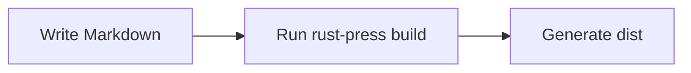

# Markdown Tutorial

RustPress parses Markdown with `pulldown-cmark` and adds handling for code blocks, heading anchors, search text, and Mermaid.

## Frontmatter

```yaml
---
title: Page Title
layout: doc
sidebar: true
search: true
access: public
---
```

Common uses:

- Hide a page from search: `search: false`
- Show the front-end mask: `access: masked`
- Exclude from generated sidebars: `sidebar: false`

## Headings

```markdown
# H1
## H2
### H3
```

RustPress generates stable anchors. Duplicate headings get numeric suffixes, and CJK characters are preserved.

```markdown
## Configuration
## Configuration
```

This creates links similar to `#configuration` and `#configuration-2`.

## Paragraphs and Emphasis

```markdown
First paragraph.

Second paragraph.

*Italic*
**Bold**
***Bold italic***
~~Strikethrough~~
```

## Lists and Tasks

```markdown
- Write config
- Write docs
  - Feature pages
  - Config page

1. Init project
2. Build site
3. Deploy dist

- [x] Generate pages
- [ ] Publish docs
```

## Links and Images

```markdown
[CLI guide](/en/guide/cli/)
[External link](https://github.com/ZenithInc/rust-press)


```

Use root-relative links for site pages. Relative links in locale config are automatically prefixed.

## Tables

```markdown
| Config | Purpose |
| --- | --- |
| `top_nav` | Top navigation |
| Markdown paths | Generated sidebar |
| `locales` | Multilingual routing |
```

## Quotes and Footnotes

```markdown
> The access mask is not authentication.

RustPress supports footnotes.[^note]

[^note]: Footnotes are rendered near the end of the page.
```

## Code Blocks

Add a language name for highlighting and a visible language label.

````markdown
```bash
rust-press build --config rustpress.toml
```

```rust
fn main() {
    println!("hello");
}
```
````

Code blocks show line numbers and copy buttons by default:

```toml
[markdown]
code_line_numbers = false
```

## Mermaid

`mermaid` fences render as diagrams:

````markdown

````


## Heading Attributes

```markdown
## Installation {#install}
```

Then link to `/en/guide/markdown-tutorial/#install`.

## Markdown Source Copy

RustPress writes `index.md.txt` for every page. The theme exposes:

- Copy Markdown
- Copy Markdown URL

This is useful for review, automation, and external tools.

## Search Text

Search text comes from Markdown content. Code blocks are excluded by default; set `index_code = true` to index them.
