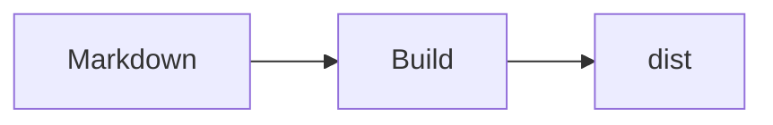

# Markdown チュートリアル

RustPress は `pulldown-cmark` で Markdown を解析し、コードブロック、見出しアンカー、検索テキスト、Mermaid を追加処理します。

## Frontmatter

```yaml
---
title: Page Title
layout: doc
sidebar: true
search: true
access: public
---
```

- 検索から除外: `search: false`
- マスク表示: `access: masked`
- 自動サイドバーから除外: `sidebar: false`

## 見出し

```markdown
# H1
## H2
### H3
```

見出しには安定したアンカーが生成されます。重複時は `-2`、`-3` が付きます。

## 強調とリスト

```markdown
*Italic*
**Bold**
~~Strikethrough~~

- item
  - child

1. first
2. second

- [x] done
- [ ] todo
```

## リンク、画像、表

```markdown
[CLI](/ja/guide/cli/)


| 設定 | 用途 |
| --- | --- |
| `top_nav` | トップナビ |
| Markdown パス | 自動サイドバー |
```

## 引用と脚注

```markdown
> アクセスマスクは認証ではありません。

脚注を使えます。[^note]

[^note]: 脚注の内容。
```

## コードブロック

````markdown
```bash
rust-press build --config rustpress.toml
```

```rust
fn main() {
    println!("hello");
}
```
````

コードブロックにはハイライト、行番号、コピーボタンが付きます。

## Mermaid

````markdown

````


## Markdown ソースコピー

各ページに `index.md.txt` が生成されます。テーマから Markdown 本文と URL をコピーできます。
