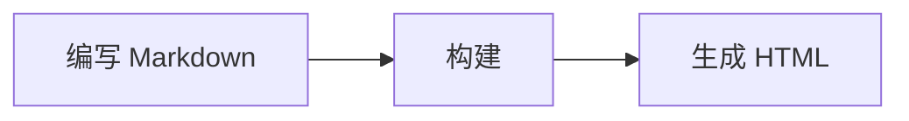

# Markdown 教程

这篇教程汇总常用 Markdown 语法，以及 RustPress 当前启用的扩展语法。示例可以直接复制到 `docs/` 下的 `.md` 文件中使用。

## Frontmatter

每篇文档可以在文件顶部写 YAML frontmatter，用来声明标题、搜索、访问方式等页面元数据。

```yaml
---
title: 页面标题
layout: doc
sidebar: true
search: true
access: public
---
```

## 标题

使用 `#` 表示标题层级，`#` 越多层级越深。

```markdown
# 一级标题
## 二级标题
### 三级标题
#### 四级标题
```

RustPress 会为标题生成稳定锚点，例如 `## Markdown 教程` 会生成可跳转的标题链接。

## 段落和换行

普通文本之间空一行会形成新的段落。

```markdown
这是第一段。

这是第二段。
```

如果只想在同一段内换行，可以在行尾添加两个空格，或直接使用 HTML 的 `<br>`。

```markdown
第一行  
第二行
```

## 强调

使用 `*` 或 `_` 表示斜体和加粗，使用 `~~` 表示删除线。

```markdown
*斜体*
_斜体_

**加粗**
__加粗__

***加粗斜体***

~~删除线~~
```

## 列表

无序列表使用 `-`、`*` 或 `+`，有序列表使用数字加点号。

```markdown
- 第一项
- 第二项
  - 子项
  - 子项

1. 第一步
2. 第二步
3. 第三步
```

## 任务列表

任务列表使用 `- [ ]` 和 `- [x]`。

```markdown
- [x] 完成配置
- [ ] 编写文档
- [ ] 发布站点
```

## 链接和图片

链接使用 `[文字](地址)`，图片使用 ``。

```markdown
[访问首页](/)
[命令行指南](/guide/cli/)


```

也可以给链接和图片加标题。

```markdown
[RustPress](/ "返回首页")

```

## 引用

引用使用 `>`，可以连续写多行，也可以嵌套。

```markdown
> 这是引用内容。
>
> 引用可以包含多段文字。

> 一级引用
>> 二级引用
```

## 行内代码

行内代码使用反引号包裹。

```markdown
运行 `rust-press build` 生成静态站点。
```

## 代码块

代码块使用三个反引号，并建议写上语言名以启用高亮。

````markdown
```bash
rust-press build --config rustpress.toml
```

```rust
fn main() {
    println!("hello");
}
```
````

## 表格

表格使用竖线分隔列，第二行的 `---` 定义表头。

```markdown
| 语法 | 用途 |
| --- | --- |
| `#` | 标题 |
| `-` | 无序列表 |
| `` `code` `` | 行内代码 |
```

可以用冒号控制对齐方式。

```markdown
| 左对齐 | 居中 | 右对齐 |
| :--- | :---: | ---: |
| A | B | C |
```

## 脚注

脚注使用 `[^name]` 标记，并在文档其他位置定义内容。

```markdown
RustPress 支持脚注。[^note]

[^note]: 这是脚注内容。
```

## 标题属性

可以给标题指定自定义属性。最常见的是自定义 `id`。

```markdown
## 安装 {#install}
```

这样可以使用 `/guide/markdown-tutorial/#install` 跳转到该标题。

## Mermaid 图

语言为 `mermaid` 的代码块会渲染为图示。

````markdown

````

## 分隔线

使用三个或更多 `-`、`*` 或 `_` 可以生成分隔线。

```markdown
---
***
___
```

## 转义字符

如果需要显示 Markdown 保留字符本身，可以在前面加反斜杠。

```markdown
\# 这不是标题
\* 这不是列表
\[这不是链接\](https://example.com)
```

## HTML

Markdown 中可以直接写少量 HTML。建议只在 Markdown 语法无法表达时使用。

```html
<kbd>Shift</kbd>
<br>
<span class="custom">自定义内容</span>
```
