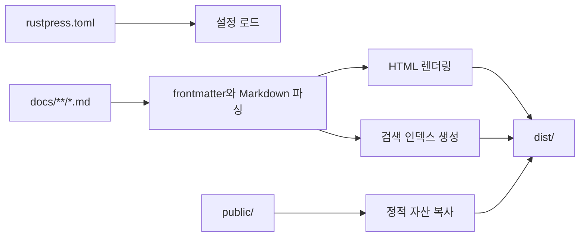

# RustPress

RustPress는 Rust-first 정적 문서 생성기입니다. `rustpress.toml`을 읽고 `docs/`의 Markdown을 정적 HTML로 렌더링하며, 테마 자산, 로컬 검색 인덱스, 복사 가능한 Markdown 원본 파일을 생성합니다.

## 기능 지도

| 기능 | RustPress가 하는 일 | 문서 |
| --- | --- | --- |
| CLI | 초기화, 빌드, 개발 서버, 미리보기 | [CLI](/ko/guide/cli/) |
| 설정 | `top_nav`, 자동 사이드바, `locales`, 테마, 검색, 접근 마스크 | [설정](/ko/guide/configuration/) |
| Markdown | 표, 작업 목록, 각주, 코드 하이라이트, 줄 번호, 복사 버튼 | [Markdown](/ko/features/markdown/) |
| Mermaid | `mermaid` 코드 블록을 다이어그램으로 렌더링 | [Markdown 튜토리얼](/ko/guide/markdown-tutorial/) |
| 테마 | 상단 내비게이션, 사이드바, 목차, Light/Dark, GitHub 링크 | [테마](/ko/features/theme/) |
| 검색 | JSON 기반 로컬 검색, 영어와 CJK 지원 | [검색](/ko/features/search/) |
| 다국어 | `.<locale>.md` suffix, 언어 전환, 번역 fallback 처리 | [설정](/ko/guide/configuration/#다국어-문서) |
| 접근 마스크 | `access: masked` 페이지에 프런트엔드 비밀번호 마스크 표시 | [접근 마스크](/ko/features/access-mask/) |
| 내부 구조 | CLI, core, Markdown, theme, search, dev server crate 분리 | [Crates](/ko/internals/crates/) |

## 빌드 흐름



## 출력물

- 각 페이지의 `index.html`
- 각 페이지의 `index.md.txt`
- `assets/rustpress.css`, `assets/rustpress.js`
- 검색 자산 `search-index.json`, `search-index.json.br`, `rustpress_search_bg.wasm`
- `public/`의 정적 파일

## 빠른 시작

```bash
cargo install rust-press
rust-press init my-docs
cd my-docs
rust-press dev
```

정적 파일 생성:

```bash
rust-press build --config rustpress.toml
```

## 보안 경계

RustPress는 정적 파일을 생성합니다. 접근 마스크는 표시 계층일 뿐 HTML을 암호화하지 않습니다. 민감한 문서는 호스팅 계층의 실제 인증 뒤에 배포하세요.
