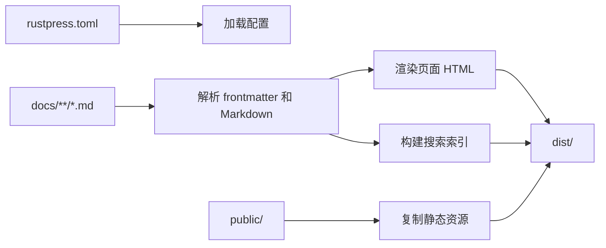

# RustPress

RustPress 是一个 Rust-first 的静态文档生成器。它读取 `rustpress.toml`，把 `docs/` 中的 Markdown 渲染为静态 HTML，写入主题资源、本地搜索索引和可复制的 Markdown 源文件。

## 适合什么场景

- 项目文档、CLI 手册、SDK 说明和内部知识库。
- 希望用一个 TOML 文件控制顶部导航、多语言入口和主题行为，同时让侧边栏从目录自动生成。
- 需要纯静态输出，可部署到 GitHub Pages、对象存储或任意静态文件服务器。
- 想要开箱即用的搜索、暗色模式、代码复制、Mermaid 图和前端访问遮罩。

## 功能地图

| 功能 | RustPress 做什么 | 入口 |
| --- | --- | --- |
| CLI 工作流 | 初始化项目、构建静态站点、开发热刷新、预览产物 | [命令行](/guide/cli/) |
| 配置系统 | `top_nav`、自动侧边栏、`locales`、主题、搜索、访问遮罩 | [配置](/guide/configuration/) |
| Markdown 渲染 | 表格、任务列表、脚注、标题属性、代码高亮、行号、复制按钮 | [Markdown](/features/markdown/) |
| Mermaid | `mermaid` fenced code block 在浏览器中渲染为图 | [Markdown 教程](/guide/markdown-tutorial/) |
| 主题 | 顶部导航、侧边栏、目录、移动端布局、Light/Dark 切换、GitHub 链接 | [主题](/features/theme/) |
| 搜索 | 构建本地 JSON 索引，支持英文大小写归一和 CJK 内容 | [搜索](/features/search/) |
| 多语言 | `.<locale>.md` 文件后缀、语言切换、翻译页面回退 | [配置](/guide/configuration/#多语言文档) |
| 访问遮罩 | 对 `access: masked` 页面显示前端密码遮罩 | [访问遮罩](/features/access-mask/) |
| 工作区架构 | 多 crate 拆分，核心构建、Markdown、主题、搜索、开发服务器解耦 | [Crates](/internals/crates/) |

## 构建流程



## 生成的静态内容

一次构建会写入：

- 每个页面的 `index.html`。
- 每个页面对应的 `index.md.txt`，用于页面右下角复制 Markdown 或复制 Markdown URL。
- `assets/rustpress.css` 和 `assets/rustpress.js`。
- 搜索开启时的 `assets/search-index.json`、`assets/search-index.json.br` 和 `assets/rustpress_search_bg.wasm`。
- `public/` 下的自定义资源。

## 快速开始

```bash
cargo install rust-press
rust-press init my-docs
cd my-docs
rust-press dev
```

开发时访问默认地址 `http://127.0.0.1:5177/`。准备发布时运行：

```bash
rust-press build --config rustpress.toml
```

## 重要边界

RustPress 输出的是静态文件。访问遮罩只是一层前端查看遮挡，不会加密 HTML，不会阻止别人直接读取构建产物。如果需要真正权限控制，应把 RustPress 站点部署到带认证能力的服务后面。
