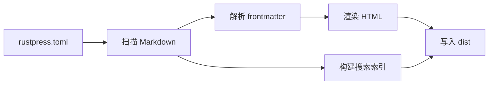

# RustPress

RustPress 是一个 Rust-first 的静态文档生成器 MVP。它读取 `rustpress.toml`，扫描 `docs/` 中的 Markdown，渲染静态 HTML，写入主题资源，并构建本地搜索索引。

## 当前 MVP

- `rust-press init [dir]` 创建一个最小文档项目。
- `rust-press build` 将 Markdown 渲染到 `dist/`。
- `rust-press dev` 在 Markdown 或配置文件变化时重新构建。
- `rust-press preview` 提供已生成静态站点的预览服务。
- 默认主题包含 Light/Dark 切换、本地搜索、Mermaid 渲染、侧边栏导航和前端访问遮罩。

## 构建流程

## 试试搜索

搜索英文词如 `theme`、`build` 或 `Mermaid`。搜索也包含中文内容，例如 `搜索` 和 `访问遮罩`。

## 静态输出

生成的站点完全是静态文件。访问遮罩只是用户界面层；页面 HTML 仍然存在于 `dist/` 中。
