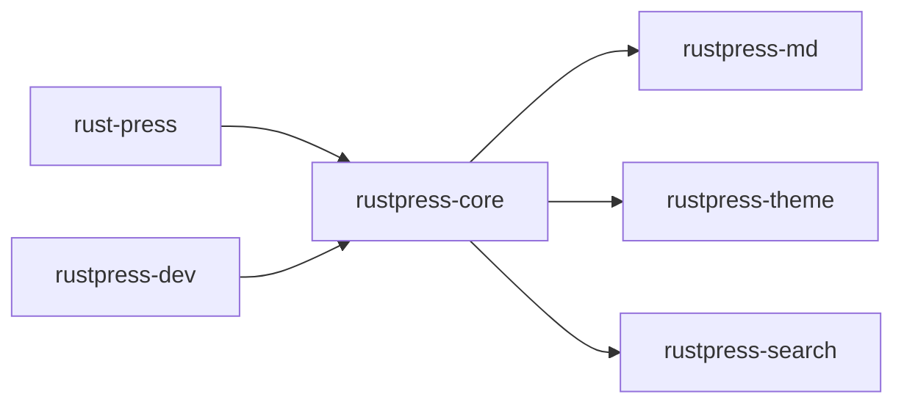

# Crates

The RustPress workspace is split into small crates with clear responsibilities.

## Overview



## rust-press

CLI entrypoint. It defines:

- `init`
- `build`
- `dev`
- `preview`

The CLI dispatches to core and dev crates; it does not parse Markdown or render HTML directly.

## rustpress-core

Build pipeline:

- Load and normalize `rustpress.toml`.
- Reject old `nav` config and require `top_nav`.
- Scan Markdown from `src_dir`.
- Compute routes, locales, and translation mapping.
- Build top navigation, generated sidebars, and language options.
- Call Markdown, theme, and search crates.
- Write HTML, Markdown source files, theme assets, and search assets.
- Copy `public/` assets.

## rustpress-md

Markdown processing:

- Parse YAML frontmatter.
- Enable tables, footnotes, strikethrough, task lists, and heading attributes.
- Generate heading anchors.
- Render code blocks, highlight, line numbers, and copy buttons.
- Special-case Mermaid blocks.
- Extract search text.

## rustpress-theme

Default theme:

- Render HTML shell.
- Render top nav, sidebar, table of contents, and language switcher.
- Write `rustpress.css` and `rustpress.js`.
- Provide search UI, color mode switch, access mask, code copy, and Markdown copy.
- Provide Mermaid theme variables and rerender logic.

## rustpress-search

Local search index:

- Accept page title, URL, headings, and body.
- Generate stable page ids.
- Tokenize English and CJK content.
- Output JSON index.
- Keep a wasm placeholder asset.

## rustpress-dev

Development and preview server:

- `preview` serves the built `out_dir`.
- `dev` builds, watches `src_dir` and the config file, and rebuilds on changes.
- Injects live reload into HTML.
- Serves common static content types.

## Data Flow

```text
rustpress.toml
docs/**/*.md
public/**
    |
    v
rustpress-core
    |
    +-- rustpress-md      -> page html + headings + search text
    +-- rustpress-theme   -> full html + css/js
    +-- rustpress-search  -> search-index.json
    v
dist/
```

This split keeps the CLI, build pipeline, Markdown renderer, theme, search, and dev server independently testable.
