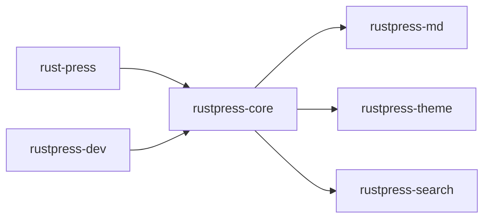

# Crates

RustPress workspace は責務ごとに crate を分けています。



## rust-press

CLI 入口です。`init`、`build`、`dev`、`preview` を定義し、core/dev crate に処理を渡します。

## rustpress-core

設定読み込み、旧 `nav` の拒否、Markdown scan、route と locale 計算、ナビゲーション生成、HTML/検索/資産出力を担当します。

## rustpress-md

frontmatter、Markdown 拡張、見出しアンカー、コードブロック、Mermaid、検索テキスト抽出を担当します。

## rustpress-theme

HTML shell、CSS、JavaScript 実行時スクリプト、ナビ、サイドバー、目次、言語切替、検索 UI、色モード、アクセスマスク、コピー機能を提供します。

## rustpress-search

ページの title、URL、見出し、本文からローカル検索索引を生成します。英語と CJK token に対応します。

## rustpress-dev

`dev` と `preview` の静的サーバーです。`dev` では監視、再ビルド、live reload を行います。

## データフロー

```text
rustpress.toml + docs/**/*.md + public/**
    -> rustpress-core
    -> rustpress-md / rustpress-theme / rustpress-search
    -> dist/
```
