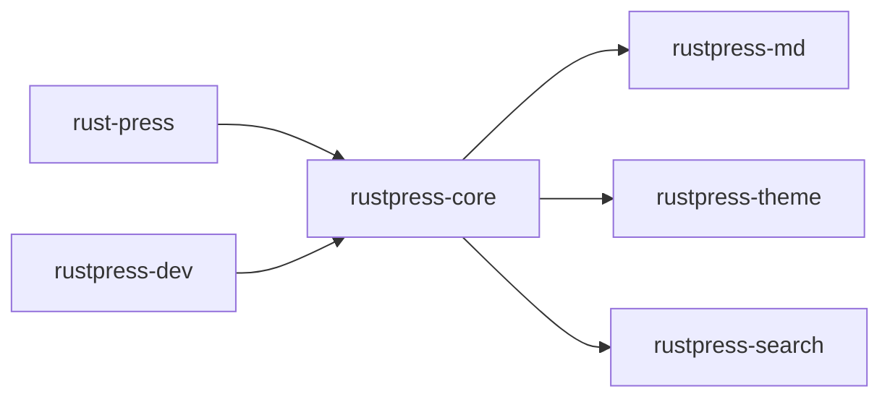

# Crates

RustPress workspace는 책임별로 crate를 나눕니다.



## rust-press

CLI 진입점입니다. `init`, `build`, `dev`, `preview`를 정의하고 core/dev crate로 작업을 전달합니다.

## rustpress-core

설정 로드, 이전 `nav` 거부, Markdown scan, route와 locale 계산, 내비게이션 생성, HTML/검색/자산 출력을 담당합니다.

## rustpress-md

frontmatter, Markdown 확장, 제목 앵커, 코드 블록, Mermaid, 검색 텍스트 추출을 담당합니다.

## rustpress-theme

HTML shell, CSS, JavaScript 실행 스크립트, 내비게이션, 사이드바, 목차, 언어 전환, 검색 UI, 색상 모드, 접근 마스크, 복사 기능을 제공합니다.

## rustpress-search

페이지 title, URL, heading, body에서 로컬 검색 인덱스를 생성합니다. 영어와 CJK token을 지원합니다.

## rustpress-dev

`dev`와 `preview` 정적 서버입니다. `dev`에서는 감시, 재빌드, live reload를 수행합니다.

## 데이터 흐름

```text
rustpress.toml + docs/**/*.md + public/**
    -> rustpress-core
    -> rustpress-md / rustpress-theme / rustpress-search
    -> dist/
```
