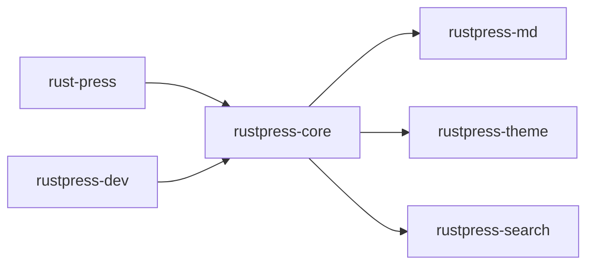

# Crates

RustPress workspace 被拆分为多个 crate。每个 crate 负责一个边界清晰的功能。

## 架构总览



## rust-press

CLI 入口。它使用 `clap` 定义命令：

- `init`
- `build`
- `dev`
- `preview`

CLI 不直接处理 Markdown 或 HTML，只把参数分发给 core 和 dev crate。

## rustpress-core

构建管线核心：

- 加载并规范化 `rustpress.toml`。
- 拒绝旧 `nav` 配置，要求使用 `top_nav`。
- 扫描 `src_dir` 下的 Markdown。
- 计算路由、多语言 locale、翻译映射。
- 构建顶部导航、侧边栏和语言切换器。
- 调用 Markdown、主题和搜索 crate。
- 写入 HTML、Markdown 源文件、主题资源、搜索资源。
- 复制 `public/` 静态资源。

## rustpress-md

Markdown 处理：

- 解析 YAML frontmatter。
- 启用表格、脚注、删除线、任务列表、标题属性。
- 生成标题锚点。
- 渲染代码块、高亮、行号、复制按钮。
- 特殊处理 Mermaid block。
- 提取搜索文本。

## rustpress-theme

默认主题：

- 渲染页面 HTML shell。
- 渲染顶部导航、侧边栏、目录、语言切换器。
- 写入 `rustpress.css` 和 `rustpress.js`。
- 提供搜索 UI、颜色模式切换、访问遮罩、代码复制、Markdown 复制。
- 提供 Mermaid 主题变量和重新渲染逻辑。

## rustpress-search

本地搜索索引：

- 接收页面标题、URL、标题和正文。
- 生成稳定页面 id。
- 对英文和 CJK 内容生成 token。
- 输出 JSON 索引。
- 保留 wasm placeholder 资源。

## rustpress-dev

开发和预览服务器：

- `preview` 服务已构建的 `out_dir`。
- `dev` 先构建，再监听 `src_dir` 和配置文件。
- 变更后重新构建。
- 向 HTML 注入 live reload 脚本。
- 提供常见静态资源 content type。

## 数据流

```text
rustpress.toml
docs/**/*.md
public/**
    |
    v
rustpress-core
    |
    +-- rustpress-md      -> page html + headings + search text
    +-- rustpress-theme   -> full html + css/js
    +-- rustpress-search  -> search-index.json
    v
dist/
```

这个拆分让 CLI、构建、Markdown、主题、搜索和开发服务器可以分别测试和演进。
