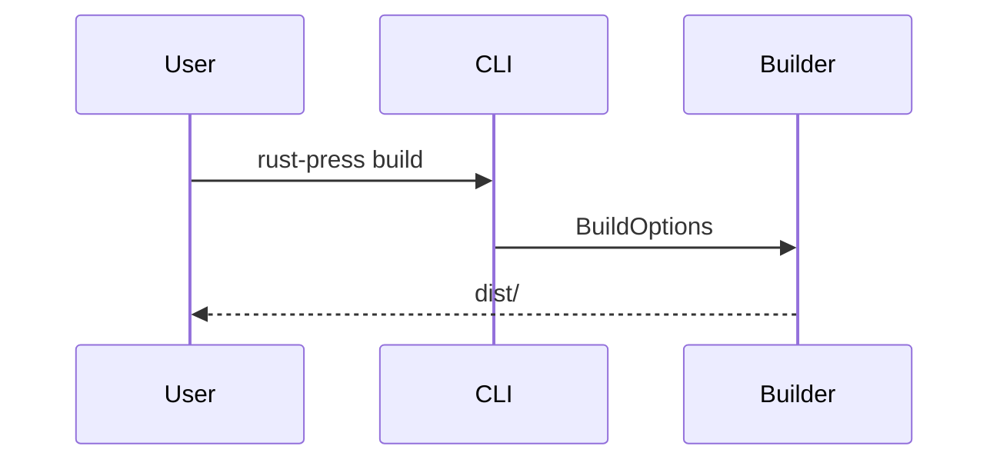

# Markdown

Markdown は `pulldown-cmark` によって解析されます。MVP では、テーブル、タスクリスト、取り消し線、脚注、見出し属性、見出しアンカー、Mermaid fenced blocks が有効です。

## 見出しアンカー

すべての見出しには安定したアンカーが付与されます。非 ASCII の見出しは保持されるため、`中文 标题` のような見出しは `#中文-标题` になります。

## コードブロック

通常の fenced code block はデフォルトで行番号を表示します。`rustpress.toml` で `code_line_numbers = false` を設定すると行番号を無効にできます。コピーボタンはコード内容だけをコピーします。

## Mermaid

`mermaid` 言語の fenced code block は Mermaid block として出力され、クライアント側の Mermaid スクリプトでレンダリングされます。

## 検索テキスト

`index_code = false` の場合、コードブロックは検索インデックスから除外されます。
