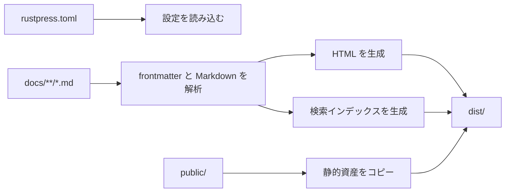

# RustPress

RustPress は Rust-first の静的ドキュメントジェネレーターです。`rustpress.toml` を読み込み、`docs/` の Markdown を静的 HTML に変換し、テーマ資産、ローカル検索インデックス、コピー可能な Markdown ソースを生成します。

## できること

| 機能 | 内容 | 詳細 |
| --- | --- | --- |
| CLI | 初期化、ビルド、開発サーバー、プレビュー | [CLI](/ja/guide/cli/) |
| 設定 | `top_nav`、`sidebars`、`locales`、テーマ、検索、アクセスマスク | [設定](/ja/guide/configuration/) |
| Markdown | 表、タスクリスト、脚注、コードハイライト、行番号、コピー | [Markdown](/ja/features/markdown/) |
| Mermaid | `mermaid` コードブロックを図として表示 | [Markdown チュートリアル](/ja/guide/markdown-tutorial/) |
| テーマ | トップナビ、サイドバー、目次、Light/Dark、GitHub リンク | [テーマ](/ja/features/theme/) |
| 検索 | JSON ベースのローカル検索、英語と CJK 対応 | [検索](/ja/features/search/) |
| 多言語 | `docs/<locale>/`、言語切替、翻訳フォールバック | [設定](/ja/guide/configuration/#多言語ドキュメント) |
| アクセスマスク | `access: masked` ページにフロントエンドのパスワードマスクを表示 | [アクセスマスク](/ja/features/access-mask/) |
| 内部構成 | CLI、core、Markdown、theme、search、dev server の crate 分割 | [Crates](/ja/internals/crates/) |

## ビルドの流れ



## 出力

- 各ページの `index.html`
- 各ページの `index.md.txt`
- `assets/rustpress.css` と `assets/rustpress.js`
- 検索資産 `search-index.json`、`search-index.json.br`、`rustpress_search_bg.wasm`
- `public/` の静的ファイル

## クイックスタート

```bash
cargo install rust-press
rust-press init my-docs
cd my-docs
rust-press dev
```

静的出力を作るには:

```bash
rust-press build --config rustpress.toml
```

## 注意

RustPress は静的ファイルを生成します。アクセスマスクは表示上の遮蔽であり、HTML を暗号化しません。機密情報にはホスティング側の認証を使ってください。
