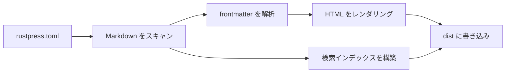

# RustPress

RustPress は Rust-first の静的ドキュメントジェネレーター MVP です。`rustpress.toml` を読み込み、`docs/` の Markdown をスキャンし、静的 HTML をレンダリングし、テーマアセットを書き込み、ローカル検索インデックスを構築します。

## 現在の MVP

- `rust-press init [dir]` は最小構成のドキュメントプロジェクトを作成します。
- `rust-press build` は Markdown を `dist/` にレンダリングします。
- `rust-press dev` は Markdown または設定ファイルが変更されたときに再ビルドします。
- `rust-press preview` は生成済みの静的出力を配信します。
- デフォルトテーマには、Light/Dark 切り替え、ローカル検索、Mermaid レンダリング、サイドバーナビゲーション、フロントエンドのアクセスマスクが含まれます。

## ビルドフロー

## 検索を試す

`theme`、`build`、`Mermaid` などの英単語を検索できます。検索には中国語の内容も含まれます。たとえば `搜索` や `访问遮罩` を試せます。

## 静的出力

生成されるサイトは完全に静的です。アクセスマスクはユーザーインターフェイス層にすぎません。ページ HTML は引き続き `dist/` に存在します。
