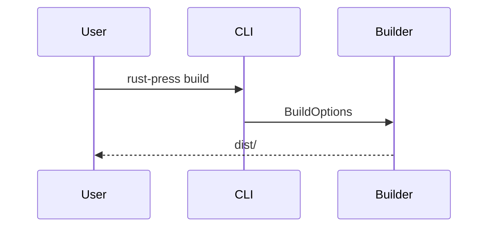

# Markdown

Markdown은 `pulldown-cmark`로 파싱됩니다. MVP는 표, 작업 목록, 취소선, 각주, 제목 속성, 제목 앵커, Mermaid fenced blocks를 활성화합니다.

## 제목 앵커

모든 제목에는 안정적인 앵커가 부여됩니다. ASCII가 아닌 제목은 보존되므로 `中文 标题` 같은 제목은 `#中文-标题`가 됩니다.

## 코드 블록

일반 fenced code block은 기본적으로 줄 번호를 표시합니다. `rustpress.toml`에서 `code_line_numbers = false`를 설정하면 줄 번호를 끌 수 있습니다. 복사 버튼은 코드 내용만 복사합니다.

## Mermaid

`mermaid` 언어의 fenced code block은 Mermaid block으로 출력되고 클라이언트 측 Mermaid 스크립트로 렌더링됩니다.

## 검색 텍스트

`index_code = false`이면 코드 블록은 검색 인덱스에서 제외됩니다.
