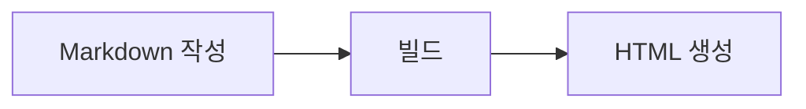

# Markdown 튜토리얼

이 튜토리얼은 자주 쓰는 Markdown 문법과 RustPress에서 현재 활성화된 확장 문법을 정리합니다. 예시는 `docs/` 아래의 `.md` 파일에 그대로 복사해 사용할 수 있습니다.

## Frontmatter

각 문서 맨 위에는 YAML frontmatter를 작성할 수 있습니다. 제목, 검색, 접근 방식 같은 페이지 메타데이터를 정의합니다.

```yaml
---
title: 페이지 제목
layout: doc
sidebar: true
search: true
access: public
---
```

## 제목

제목은 `#`으로 표시합니다. `#`이 많을수록 더 깊은 제목 단계입니다.

```markdown
# 제목 1
## 제목 2
### 제목 3
#### 제목 4
```

RustPress는 제목에 안정적인 앵커를 생성하므로 각 섹션에 직접 링크할 수 있습니다.

## 문단과 줄바꿈

빈 줄로 텍스트를 구분하면 새 문단이 됩니다.

```markdown
첫 번째 문단입니다.

두 번째 문단입니다.
```

같은 문단 안에서 줄바꿈하려면 줄 끝에 공백 두 개를 넣거나 `<br>`을 사용합니다.

```markdown
첫 번째 줄  
두 번째 줄
```

## 강조

`*` 또는 `_`로 기울임과 굵게를 표시합니다. `~~`로 취소선을 표시합니다.

```markdown
*기울임*
_기울임_

**굵게**
__굵게__

***굵은 기울임***

~~취소선~~
```

## 목록

순서 없는 목록은 `-`, `*`, `+`를 사용합니다. 순서 있는 목록은 숫자와 마침표를 사용합니다.

```markdown
- 첫 번째 항목
- 두 번째 항목
  - 하위 항목
  - 하위 항목

1. 첫 번째 단계
2. 두 번째 단계
3. 세 번째 단계
```

## 작업 목록

작업 목록은 `- [ ]`와 `- [x]`를 사용합니다.

```markdown
- [x] 설정 완료
- [ ] 문서 작성
- [ ] 사이트 게시
```

## 링크와 이미지

링크는 `[텍스트](주소)`, 이미지는 ``로 작성합니다.

```markdown
[홈으로 이동](/ko/)
[CLI 가이드](/ko/guide/cli/)


```

링크와 이미지에는 제목을 추가할 수도 있습니다.

```markdown
[RustPress](/ko/ "홈으로 돌아가기")

```

## 인용

인용은 `>`를 사용합니다. 여러 줄로 작성하거나 중첩할 수 있습니다.

```markdown
> 이것은 인용입니다.
>
> 인용은 여러 문단을 포함할 수 있습니다.

> 1단계 인용
>> 2단계 인용
```

## 인라인 코드

인라인 코드는 백틱으로 감쌉니다.

```markdown
`rust-press build`를 실행해 정적 사이트를 생성합니다.
```

## 코드 블록

코드 블록은 백틱 세 개를 사용합니다. 언어 이름을 추가하면 문법 강조가 활성화됩니다.

````markdown
```bash
rust-press build --config rustpress.toml
```

```rust
fn main() {
    println!("hello");
}
```
````

## 표

표는 파이프로 열을 구분합니다. 두 번째 줄의 `---`가 헤더 구분선입니다.

```markdown
| 문법 | 용도 |
| --- | --- |
| `#` | 제목 |
| `-` | 순서 없는 목록 |
| `` `code` `` | 인라인 코드 |
```

콜론으로 정렬을 제어할 수 있습니다.

```markdown
| 왼쪽 | 가운데 | 오른쪽 |
| :--- | :---: | ---: |
| A | B | C |
```

## 각주

각주는 `[^name]` 표시와 문서 내 정의를 사용합니다.

```markdown
RustPress는 각주를 지원합니다.[^note]

[^note]: 이것은 각주 내용입니다.
```

## 제목 속성

제목에는 사용자 지정 속성을 지정할 수 있습니다. 가장 흔한 사용법은 사용자 지정 `id`입니다.

```markdown
## 설치 {#install}
```

이렇게 하면 `/ko/guide/markdown-tutorial/#install` 같은 링크를 사용할 수 있습니다.

## Mermaid 다이어그램

언어가 `mermaid`인 코드 블록은 다이어그램으로 렌더링됩니다.

````markdown

````

## 구분선

세 개 이상의 `-`, `*`, `_`로 구분선을 만들 수 있습니다.

```markdown
---
***
___
```

## 문자 이스케이프

Markdown 제어 문자를 그대로 표시하려면 앞에 백슬래시를 붙입니다.

```markdown
\# 이것은 제목이 아닙니다
\* 이것은 목록이 아닙니다
\[이것은 링크가 아닙니다\](https://example.com)
```

## HTML

Markdown 안에 소량의 HTML을 직접 작성할 수 있습니다. Markdown으로 표현할 수 없는 경우에만 사용하는 것이 좋습니다.

```html
<kbd>Shift</kbd>
<br>
<span class="custom">사용자 지정 내용</span>
```
