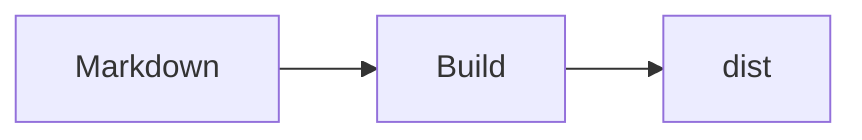

# Markdown 튜토리얼

RustPress는 `pulldown-cmark`로 Markdown을 파싱하고 코드 블록, 제목 앵커, 검색 텍스트, Mermaid를 추가 처리합니다.

## Frontmatter

```yaml
---
title: Page Title
layout: doc
sidebar: true
search: true
access: public
---
```

- 검색 제외: `search: false`
- 접근 마스크 표시: `access: masked`
- 자동 사이드바 제외: `sidebar: false`

## 제목

```markdown
# H1
## H2
### H3
```

제목에는 안정적인 앵커가 생성됩니다. 중복 제목에는 `-2`, `-3`이 붙습니다.

## 강조와 목록

```markdown
*Italic*
**Bold**
~~Strikethrough~~

- item
  - child

1. first
2. second

- [x] done
- [ ] todo
```

## 링크, 이미지, 표

```markdown
[CLI](/ko/guide/cli/)


| 설정 | 용도 |
| --- | --- |
| `top_nav` | 상단 내비게이션 |
| `sidebars` | 사이드바 |
```

## 인용과 각주

```markdown
> 접근 마스크는 인증이 아닙니다.

각주를 사용할 수 있습니다.[^note]

[^note]: 각주 내용.
```

## 코드 블록

````markdown
```bash
rust-press build --config rustpress.toml
```

```rust
fn main() {
    println!("hello");
}
```
````

코드 블록에는 하이라이트, 줄 번호, 복사 버튼이 표시됩니다.

## Mermaid

````markdown

````


## Markdown 원본 복사

각 페이지에 `index.md.txt`가 생성됩니다. 테마에서 Markdown 본문과 Markdown URL을 복사할 수 있습니다.
