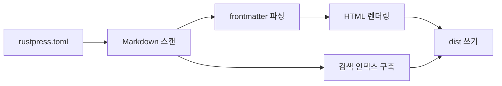

# RustPress

RustPress는 Rust-first 정적 문서 생성기 MVP입니다. `rustpress.toml`을 읽고, `docs/`의 Markdown을 스캔하고, 정적 HTML을 렌더링하고, 테마 자산을 쓰고, 로컬 검색 인덱스를 구축합니다.

## 현재 MVP

- `rust-press init [dir]`은 최소 문서 프로젝트를 만듭니다.
- `rust-press build`는 Markdown을 `dist/`로 렌더링합니다.
- `rust-press dev`는 Markdown 또는 설정 파일이 변경될 때 다시 빌드합니다.
- `rust-press preview`는 생성된 정적 출력을 제공합니다.
- 기본 테마에는 Light/Dark 전환, 로컬 검색, Mermaid 렌더링, 사이드바 내비게이션, 프런트엔드 접근 마스크가 포함됩니다.

## 빌드 흐름

## 검색해 보기

`theme`, `build`, `Mermaid` 같은 영어 단어를 검색할 수 있습니다. 검색에는 중국어 콘텐츠도 포함됩니다. 예를 들어 `搜索`와 `访问遮罩`를 검색해 볼 수 있습니다.

## 정적 출력

생성된 사이트는 완전히 정적입니다. 접근 마스크는 사용자 인터페이스 계층일 뿐입니다. 페이지 HTML은 여전히 `dist/`에 남아 있습니다.
